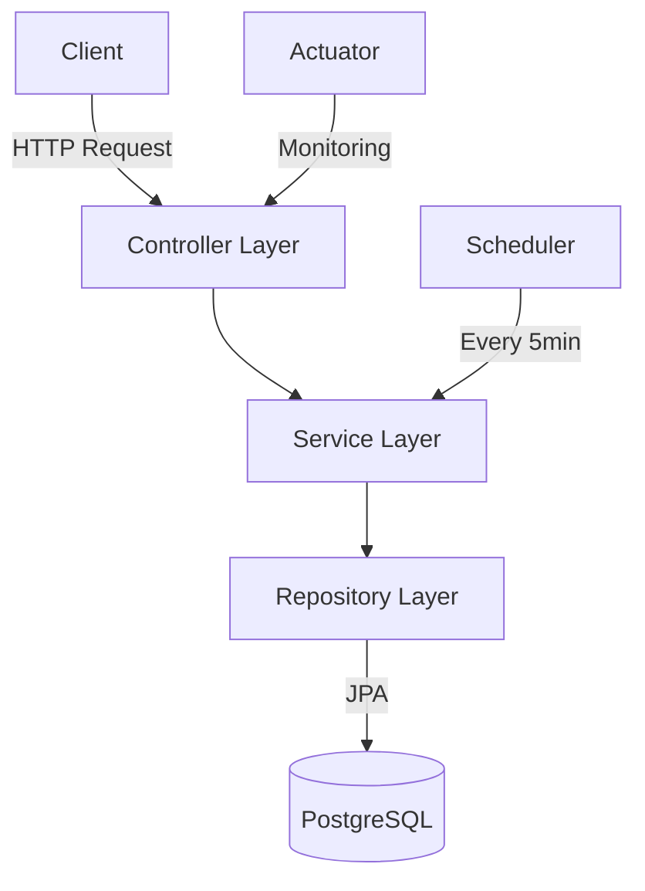

# 🛍️ Order Processing System

A robust Spring Boot microservice for managing e-commerce orders with automated status updates.

```ascii
┌─────────────────┐         ┌──────────────┐         ┌─────────────┐
│   Client Apps   │ ───────▶│  Order API   │ ───────▶│  Database   │
└─────────────────┘   HTTP  └──────────────┘   JPA   └─────────────┘
                                 │
                                 │
                          ┌─────────────┐
                          │  Scheduler  │
                          └─────────────┘
```

## 🚀 Tech Stack

```
├── Backend Framework
│   ├── Spring Boot 3.x
│   ├── Java 17
│   └── Maven
│
├── Database
│   └── PostgreSQL
│
├── Documentation
│   └── OpenAPI (Swagger)
│
├── Monitoring
│   └── Spring Actuator
│
└── Testing
    ├── JUnit 5
    ├── Mockito
    └── H2 Database
```

## 📊 System Architecture



## 🛠️ Setup & Installation

### Prerequisites
- Java 17
- Maven
- PostgreSQL
- Docker (optional)

### Local Development

1. **Clone the repository**
   ```bash
   git clone <repository-url>
   cd processing.system
   ```

2. **Configure Database**
   - Create PostgreSQL database
   - Update application.yml if needed

3. **Build the application**
   ```bash
   mvn clean install
   ```

4. **Run the application**
   ```bash
   mvn spring-boot:run
   ```

### 🐳 Docker Deployment

1. **Build Docker image**
   ```bash
   docker build -t order-processing-system .
   ```

2. **Run container**
   ```bash
   docker run -p 8080:8080 \
   -e SPRING_PROFILES_ACTIVE=prod \
   -e DB_URL=jdbc:postgresql://host.docker.internal:5432/order_processing \
   -e DB_USERNAME=your_username \
   -e DB_PASSWORD=your_password \
   order-processing-system
   ```

## 🔍 API Endpoints

### Item Management

#### 1. List All Items
```http
GET /api/items
```
**Response:**
```json
[
  {
    "id": 1,
    "name": "Smartphone",
    "price": 699.99,
    "description": "Latest model smartphone"
  },
  {
    "id": 2,
    "name": "Laptop",
    "price": 1299.99,
    "description": "High-performance laptop"
  }
]
```

#### 2. Get Item by ID
```http
GET /api/items/{id}
```
**Response:**
```json
{
  "id": 1,
  "name": "Smartphone",
  "price": 699.99,
  "description": "Latest model smartphone"
}
```

#### 3. Create Single Item
```http
POST /api/items
```
**Request Body:**
```json
{
  "name": "Smartphone",
  "price": 699.99,
  "description": "Latest model smartphone"
}
```
**Response:** Returns created item with status code 201

#### 4. Create Multiple Items
```http
POST /api/items/batch
```
**Request Body:**
```json
[
  {
    "name": "Smartphone",
    "price": 699.99,
    "description": "Latest model smartphone"
  },
  {
    "name": "Laptop",
    "price": 1299.99,
    "description": "High-performance laptop"
  }
]
```
**Response:** Returns list of created items with status code 201

#### 5. Delete Item
```http
DELETE /api/items/{id}
```
**Response:** Status code 204 (No Content)

#### 6. Delete Multiple Items
```http
DELETE /api/items/batch
```
**Request Body:**
```json
[1, 2, 3]
```
**Response:** Status code 204 (No Content)

### Order Management

#### 1. Create Order
```http
POST /api/orders
```
**Request Body:**
```json
[
  {
    "itemId": 1,
    "quantity": 2
  },
  {
    "itemId": 2,
    "quantity": 1
  }
]
```
**Response:**
```json
{
  "id": "uuid",
  "status": "PENDING",
  "createdAt": "2023-11-01T10:00:00",
  "items": [
    {
      "itemId": 1,
      "itemName": "Smartphone",
      "itemPrice": 699.99,
      "quantity": 2,
      "subtotal": 1399.98
    }
  ],
  "totalAmount": 1399.98
}
```

#### 2. Get Order Details
```http
GET /api/orders/{id}
```

#### 3. List All Orders
```http
GET /api/orders?status=PENDING
```
Query Parameters:
- `status` (optional): Filter by order status

#### 4. Cancel Order
```http
PATCH /api/orders/{id}/cancel
```

### 📊 Monitoring Endpoints

```
├── Health Check
│   └── GET /actuator/health
│
├── Metrics
│   └── GET /actuator/metrics
│
├── Environment Info
│   └── GET /actuator/env
│
└── Logs
    └── GET /actuator/loggers
```

## 📝 API Validations

### Item Request Validation
- `name`: Required, non-blank string
- `price`: Required, positive number
- `description`: Optional string

## 🔄 Business Flow

```ascii
Item Management ─────┐
                    │
                    ▼
Order Creation ──▶ PENDING ──┬──▶ PROCESSING ──▶ SHIPPED ──▶ DELIVERED
                            │
                            └──▶ CANCELLED
```

## 🚦 Order States

1. **PENDING**
   - Initial state when order is created
   - Can be cancelled
   - Auto-transitions to PROCESSING after 5 minutes

2. **PROCESSING**
   - Order is being processed
   - Cannot be cancelled
   - Can transition to SHIPPED

3. **SHIPPED**
   - Order is in transit
   - Cannot be cancelled

4. **DELIVERED**
   - Final successful state
   - Order completed

5. **CANCELLED**
   - Final cancelled state
   - Only possible from PENDING state

## 🔍 API Documentation

Access Swagger UI: `http://localhost:8080/swagger-ui.html`

## 🔧 Configuration

### Application Profiles

1. **dev**
   - Local development
   - H2 in-memory database
   - SQL logging enabled

2. **prod**
   - Production settings
   - PostgreSQL database
   - Minimal logging

### Environment Variables

```properties
DB_URL=jdbc:postgresql://host:port/dbname
DB_USERNAME=username
DB_PASSWORD=password
```

## 📈 Monitoring

### Health Checks
```http
GET /actuator/health
```
Response:
```json
{
  "status": "UP",
  "components": {
    "db": {
      "status": "UP"
    },
    "diskSpace": {
      "status": "UP"
    }
  }
}
```

### Metrics
```http
GET /actuator/metrics
```

## 🧪 Testing

Run tests:
```bash
mvn test
```

## 🌟 Features

- [x] RESTful API
- [x] Automated status updates
- [x] Database persistence
- [x] Docker support
- [x] Health monitoring
- [x] API documentation
- [x] Comprehensive testing
- [x] Transaction management

## 📝 License

This project is licensed under the MIT License - see the LICENSE.md file for details

## 🤝 Contributing

1. Fork the Project
2. Create your Feature Branch
3. Commit your Changes
4. Push to the Branch
5. Open a Pull Request
