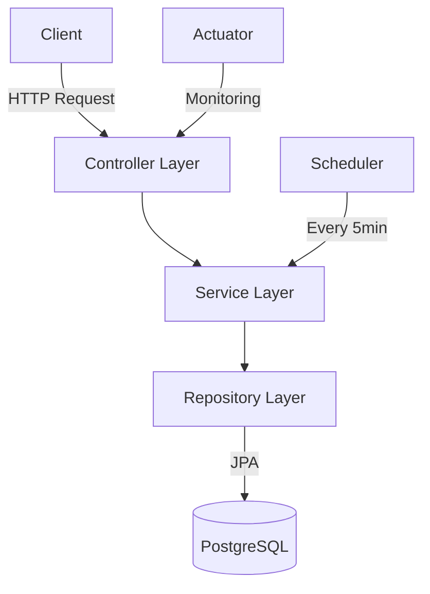
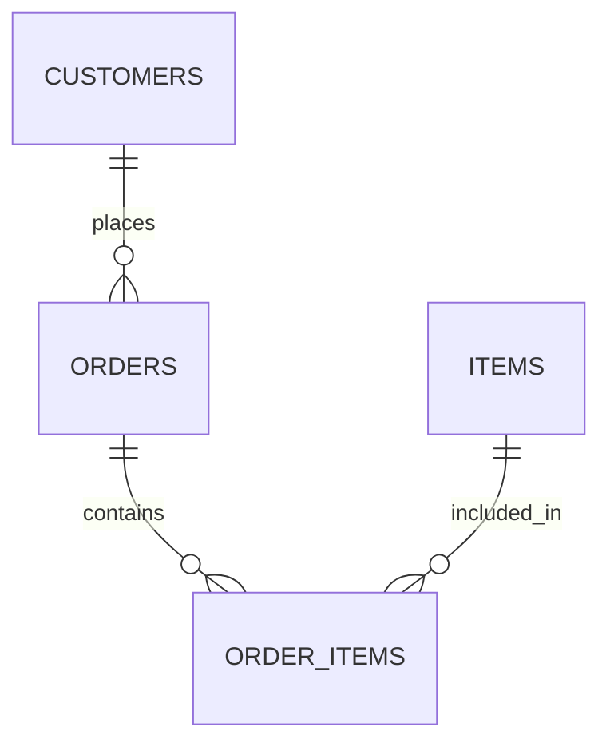

# 🛍️ Order Processing System

A robust Spring Boot microservice for managing e-commerce orders with automated status updates.

```ascii
┌─────────────────┐         ┌──────────────┐         ┌─────────────┐
│   Client Apps   │ ───────▶│  Order API   │ ───────▶│  Database   │
└─────────────────┘   HTTP  └──────────────┘   JPA   └─────────────┘
                                 │
                                 │
                          ┌─────────────┐
                          │  Scheduler  │
                          └──��────────��─┘
```

## 🚀 Tech Stack

```
├── Backend Framework
│   ├── Spring Boot 3.x
│   ├── Java 17
│   └── Maven
│
├── Database
│   └── PostgreSQL
│
├── Documentation
│   └── OpenAPI (Swagger)
│
├── Monitoring
│   └── Spring Actuator
│
└── Testing
    ├── JUnit 5
    ├── Mockito
    └── H2 Database
```

## 📊 System Architecture



## 🛠️ Setup & Installation

### Prerequisites
- Java 17
- Maven
- PostgreSQL
- Docker (optional)

### Local Development

1. **Clone the repository**
   ```bash
   git clone <repository-url>
   cd processing.system
   ```

2. **Configure Database**
   - Create PostgreSQL database
   - Update application.yml if needed

3. **Build the application**
   ```bash
   mvn clean install
   ```

4. **Run the application**
   ```bash
   mvn spring-boot:run
   ```

### 🐳 Docker Deployment

1. **Build Docker image**
   ```bash
   docker build -t order-processing-system .
   ```

2. **Run container**
   ```bash
   docker run -p 8080:8080 \
   -e SPRING_PROFILES_ACTIVE=prod \
   -e DB_URL=jdbc:postgresql://host.docker.internal:5432/order_processing \
   -e DB_USERNAME=your_username \
   -e DB_PASSWORD=your_password \
   order-processing-system
   ```

## 📊 Database Schema

### Tables Structure

#### 1. Customers
```sql
CREATE TABLE customers (
    id SERIAL PRIMARY KEY,
    name VARCHAR(255) NOT NULL,
    email VARCHAR(255) NOT NULL UNIQUE,
    phone VARCHAR(50),
    active BOOLEAN DEFAULT TRUE,
    created_at TIMESTAMP DEFAULT CURRENT_TIMESTAMP
);
```

#### 2. Items
```sql
CREATE TABLE items (
    id SERIAL PRIMARY KEY,
    name VARCHAR(255) NOT NULL,
    price DOUBLE PRECISION NOT NULL,
    description VARCHAR(255)
);
```

#### 3. Orders
```sql
CREATE TABLE orders (
    id UUID PRIMARY KEY,
    customer_id INTEGER NOT NULL,
    status VARCHAR(20) NOT NULL,
    created_at TIMESTAMP,
    updated_at TIMESTAMP,
    FOREIGN KEY (customer_id) REFERENCES customers(id)
);
```

#### 4. OrderItems
```sql
CREATE TABLE order_items (
    id SERIAL PRIMARY KEY,
    order_id UUID NOT NULL,
    item_id INTEGER NOT NULL,
    quantity INTEGER NOT NULL,
    FOREIGN KEY (order_id) REFERENCES orders(id),
    FOREIGN KEY (item_id) REFERENCES items(id)
);
```

### Entity Relationships


## 🔒 Security and API Access

### CSRF Protection
The API uses CSRF (Cross-Site Request Forgery) protection for all modifying requests (POST, PUT, PATCH, DELETE). Each request requires:
1. A CSRF token cookie (`XSRF-TOKEN`)
2. The same token in the request header (`X-XSRF-TOKEN`)

### Getting Started with API Calls

#### 1. Obtain CSRF Token
First, get a CSRF token by making any GET request:
```bash
# Using curl
curl -v -c cookie.txt https://order-processing-system-x02o.onrender.com/api/orders

# The response will include XSRF-TOKEN in cookies and headers
```

#### 2. Making API Requests

##### GET Requests (No CSRF Required)
```bash
# List all orders
curl https://order-processing-system-x02o.onrender.com/api/orders

# Get specific order
curl https://order-processing-system-x02o.onrender.com/api/orders/{id}
```

##### POST/PUT/PATCH/DELETE Requests (CSRF Required)
```bash
# 1. Store token from cookie file
TOKEN=$(cat cookie.txt | grep XSRF-TOKEN | cut -f 7)

# 2. Create new order
curl -X POST 'https://order-processing-system-x02o.onrender.com/api/orders' \
-H "Content-Type: application/json" \
-H "X-XSRF-TOKEN: $TOKEN" \
-b cookie.txt \
-d '{
  "customerId": 1,
  "items": [
    {
      "itemId": 1,
      "quantity": 2
    }
  ]
}'

# 3. Cancel order
curl -X PATCH 'https://order-processing-system-x02o.onrender.com/api/orders/{id}/cancel' \
-H "X-XSRF-TOKEN: $TOKEN" \
-b cookie.txt
```

### Using with JavaScript/Axios
```javascript
// Configure axios
const axios = require('axios');
axios.defaults.withCredentials = true;

// Function to make authenticated requests
async function makeRequest() {
  // 1. Get CSRF token
  await axios.get('https://order-processing-system-x02o.onrender.com/api/orders');
  
  // 2. Make authenticated request (axios will automatically include the token)
  const response = await axios.post('https://order-processing-system-x02o.onrender.com/api/orders', {
    customerId: 1,
    items: [
      {
        itemId: 1,
        quantity: 2
      }
    ]
  });
  
  return response.data;
}
```

### Security Notes
- CSRF tokens expire after 1 hour
- Each session gets a unique token
- Tokens are required for all modifying operations
- GET requests don't require tokens
- Include both cookie and header for token
- Use HTTPS for all requests

## 🔍 API Endpoints

### Order Management

#### 1. Create Order
```http
POST /api/orders
Content-Type: application/json
X-XSRF-TOKEN: your-csrf-token

{
  "customerId": 1,
  "items": [
    {
      "itemId": 1,
      "quantity": 2
    }
  ]
}
```
**Response:** `200 OK`
```json
{
  "id": "uuid",
  "status": "PENDING",
  "customer": {
    "id": 1,
    "name": "John Doe",
    "email": "john@example.com"
  },
  "items": [
    {
      "itemId": 1,
      "itemName": "Smartphone",
      "itemPrice": 699.99,
      "quantity": 2,
      "subtotal": 1399.98
    }
  ],
  "totalAmount": 1399.98,
  "createdAt": "2025-11-02T10:00:00",
  "updatedAt": "2025-11-02T10:00:00"
}
```

#### 2. Get Order Details
```http
GET /api/orders/{id}
```
**Response:**
```json
{
  "id": "uuid",
  "status": "PENDING",
  "customer": {
    "id": 1,
    "name": "John Doe",
    "email": "john@example.com"
  },
  "items": [
    {
      "itemId": 1,
      "itemName": "Smartphone",
      "itemPrice": 699.99,
      "quantity": 2,
      "subtotal": 1399.98
    }
  ],
  "totalAmount": 1399.98,
  "createdAt": "2025-11-02T10:00:00",
  "updatedAt": "2025-11-02T10:00:00"
}
```

#### 3. List All Orders
```http
GET /api/orders?status=PENDING
```
Query Parameters:
- `status` (optional): Filter by order status

**Response:**
```json
[
  {
    "id": "uuid",
    "status": "PENDING",
    "customer": {
      "id": 1,
      "name": "John Doe",
      "email": "john@example.com"
    },
    "items": [...],
    "totalAmount": 1399.98,
    "createdAt": "2025-11-02T10:00:00",
    "updatedAt": "2025-11-02T10:00:00"
  }
]
```

#### 4. Cancel Order
```http
PATCH /api/orders/{id}/cancel
```
**Response:**
```json
{
  "id": "uuid",
  "status": "CANCELLED",
  "customer": {
    "id": 1,
    "name": "John Doe",
    "email": "john@example.com"
  },
  "items": [...],
  "totalAmount": 1399.98,
  "createdAt": "2025-11-02T10:00:00",
  "updatedAt": "2025-11-02T10:00:00"
}
```

### 📊 Monitoring Endpoints

```
├── Health Check
│   └── GET /actuator/health
│
├── Metrics
│   └── GET /actuator/metrics
│
├── Environment Info
│   └── GET /actuator/env
│
└── Logs
    └── GET /actuator/loggers
```

## 📝 API Validations

### Item Request Validation
- `name`: Required, non-blank string
- `price`: Required, positive number
- `description`: Optional string

### Order Request Validation
- `customerId`: Required, must reference an existing customer
- `items`: Required, non-empty array of order items
- `items[].itemId`: Required, must reference an existing item
- `items[].quantity`: Required, must be positive

## 🔄 Business Flow

```ascii
Item Management ─────┐
                    │
                    ▼
Order Creation ──▶ PENDING ──┬──▶ PROCESSING ──▶ SHIPPED ──▶ DELIVERED
                            │
                            └──▶ CANCELLED
```

## 🚦 Order States

1. **PENDING**
   - Initial state when order is created
   - Can be cancelled
   - Auto-transitions to PROCESSING after 5 minutes

2. **PROCESSING**
   - Order is being processed
   - Cannot be cancelled
   - Can transition to SHIPPED

3. **SHIPPED**
   - Order is in transit
   - Cannot be cancelled

4. **DELIVERED**
   - Final successful state
   - Order completed

5. **CANCELLED**
   - Final cancelled state
   - Only possible from PENDING state

## 🔍 API Documentation

Access Swagger UI: `http://localhost:8080/swagger-ui.html`

## 🔧 Configuration

### Application Profiles

1. **dev**
   - Local development
   - H2 in-memory database
   - SQL logging enabled

2. **prod**
   - Production settings
   - PostgreSQL database
   - Minimal logging

### Environment Variables

```properties
DB_URL=jdbc:postgresql://host:port/dbname
DB_USERNAME=username
DB_PASSWORD=password
```

## 🗄️ Database Configuration

### Development (PostgreSQL)
```yaml
spring:
  datasource:
    url: jdbc:postgresql://host:port/dbname
    username: ${DB_USERNAME}
    password: ${DB_PASSWORD}
  jpa:
    hibernate:
      ddl-auto: none
    properties:
      hibernate:
        dialect: org.hibernate.dialect.PostgreSQLDialect
```

### Testing (H2)
```yaml
spring:
  datasource:
    url: jdbc:h2:mem:testdb
    username: sa
    password: 
  jpa:
    database-platform: org.hibernate.dialect.H2Dialect
    hibernate:
      ddl-auto: create-drop
```

## 📈 Monitoring

### Health Checks
```http
GET /actuator/health
```
Response:
```json
{
  "status": "UP",
  "components": {
    "db": {
      "status": "UP"
    },
    "diskSpace": {
      "status": "UP"
    }
  }
}
```

### Metrics
```http
GET /actuator/metrics
```

## 🧪 Testing

### Unit Tests
```bash
mvn test
```

The project includes comprehensive tests for:
- OrderService
- CustomerService
- ItemService
- Controllers
- Database operations

### Test Data
Sample data is automatically loaded for testing:
- Customers: 3 sample customers
- Items: 5 sample products
- Orders: Generated during tests

## 🌟 Features

- [x] RESTful API
- [x] Automated status updates
- [x] Database persistence
- [x] Docker support
- [x] Health monitoring
- [x] API documentation
- [x] Comprehensive testing
- [x] Transaction management

## 📝 License

This project is licensed under the MIT License - see the LICENSE.md file for details

## 🤝 Contributing

1. Fork the Project
2. Create your Feature Branch
3. Commit your Changes
4. Push to the Branch
5. Open a Pull Request

## 🔧 Troubleshooting

### Common Issues

#### 403 Forbidden
- Ensure CSRF token is included in both cookie and header
- Token might be expired (get a new one)
- Check if token is being sent correctly

#### Token Not Received
- Ensure cookies are enabled
- Try clearing existing cookies
- Make a fresh GET request to receive new token

#### Request Failed
1. Check token presence:
   ```bash
   # View cookie content
   cat cookie.txt
   ```
2. Verify token in headers:
   ```bash
   curl -v -H "X-XSRF-TOKEN: $TOKEN" ...
   ```
3. Ensure cookie is included:
   ```bash
   curl -b cookie.txt ...
   ```
